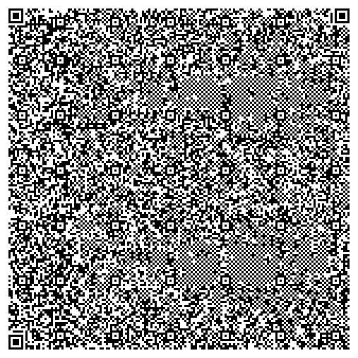

snakeqr
=======
SnakeQR is a game of snake written for the Unix console that fits entirely in a QR code.

Don't believe me?
Here it is.

This QR code is the compiled binary.
The entire ELF executable clocks in at just under 2 KB (2028 bytes, to be exact).

Why?
----
I saw
[this video](https://www.youtube.com/watch?v=ExwqNreocpg)
and figured it should be recreated on the Unix terminal.

Building
--------
Just run `make`.
This will probably only run on
[OpenBSD](https://www.openbsd.org)
as is.
Feel free to port to your Unix of choice.

Security
--------
To get a binary this small, virtually all of the OpenBSD mitigations you know and love have to be turned off.
Additionally, lots of code to hook into syscalls has to be rewritten.
This game is probably harmless but you have been warned!

License
-------
ISC License.
See `LICENSE` for details.
